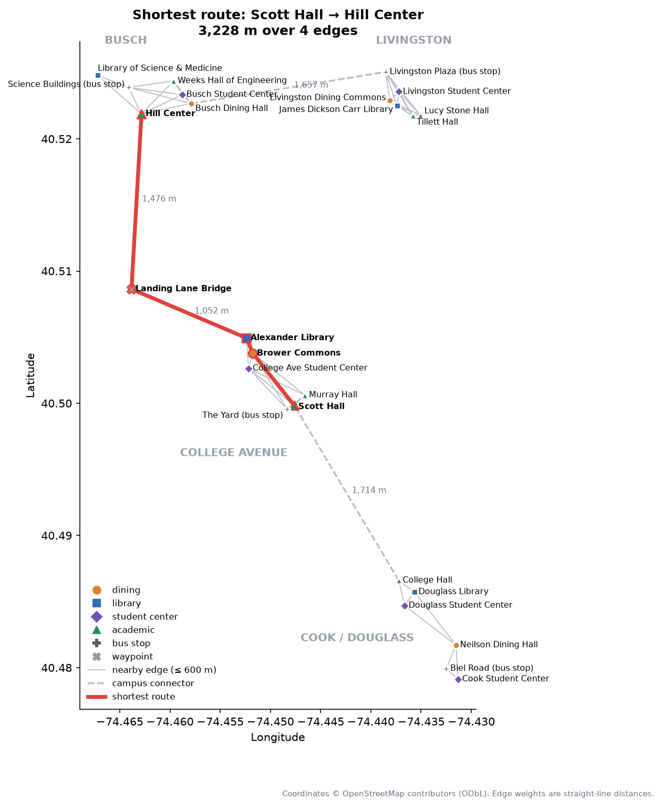

# Campus Route Finder

A command-line pathfinder for Rutgers University–New Brunswick. You give it two campus
locations and it returns the shortest route through a graph of 24 real campus locations,
using Dijkstra's algorithm, implemented from scratch with a binary-heap priority queue.
It can also find the nearest N locations of a type, such as the three closest dining halls.

**Stack:** Python (standard library only for routing), matplotlib for the map



## The data: real OpenStreetMap coordinates

Every coordinate comes from [OpenStreetMap](https://www.openstreetmap.org). None were
typed in by hand, estimated or simulated.

- [`scripts/fetch_locations.py`](scripts/fetch_locations.py) lists 25 OpenStreetMap elements
  by ID and downloads them from the [Overpass API](https://overpass-api.de).
  For example, Scott Hall is [`way/251382286`](https://www.openstreetmap.org/way/251382286).
- For a building, the coordinate is the center of the building's outline as computed by
  OpenStreetMap. For a bus stop, it's the stop's own point.
- The result is saved in [`data/locations.json`](data/locations.json). Each entry keeps its
  OSM ID and a link, so any coordinate can be checked on the map.
  The data was retrieved on 2026-09-28.
- **Chosen by hand:** which places to include, each place's category and campus, and a
  shorter display name (the full OSM name is stored as well).

The 24 destinations are six per campus area: a dining hall, a library, a student center,
academic buildings and a Rutgers bus stop. The 25th node is the **Landing Lane Bridge**
over the Raritan River, which is a waypoint, not a destination (see below).

| Campus | Dining | Library | Student center | Academic | Bus stop |
|---|---|---|---|---|---|
| College Ave | Brower Commons | Alexander Library | College Ave Student Center | Scott Hall, Murray Hall | The Yard |
| Busch | Busch Dining Hall | Library of Science & Medicine | Busch Student Center | Hill Center, Weeks Hall of Engineering | Science Buildings |
| Livingston | Livingston Dining Commons | James Dickson Carr Library | Livingston Student Center | Lucy Stone Hall, Tillett Hall | Livingston Plaza |
| Cook/Douglass | Neilson Dining Hall | Douglass Library | Cook Student Center, Douglass Student Center | College Hall | Biel Road |

The tool contains no simulated data: no wait times, crowd levels, opening hours or bus
schedules. It finds routes over real geography, and nothing else.

## Graph design

The graph is **undirected and weighted**, stored as an **adjacency list**: each location
maps to a list of its edges, and each edge records a neighbor and a distance in meters.
Code: [`route_finder/graph.py`](route_finder/graph.py).

- **Nodes:** the 25 locations above.
- **Edge weights:** the [haversine](https://en.wikipedia.org/wiki/Haversine_formula)
  (great-circle) distance between the two OpenStreetMap coordinates.
- **Nearby edges (47):** two locations on the same campus are connected if they are
  **at most 600 m apart**. 600 m is the smallest round radius that connects every campus
  internally; at 500 m, Cook/Douglass splits in two.
- **Connector edges (4):** campuses are far apart (the closest pair of locations on
  different campuses is over 1 km), so each pair of neighboring areas gets one edge
  between its two closest locations:

  | Connection | Edge | Length |
  |---|---|---|
  | College Ave ↔ Cook/Douglass | Scott Hall ↔ College Hall | 1,714 m |
  | College Ave ↔ river crossing | Alexander Library ↔ Landing Lane Bridge | 1,052 m |
  | River crossing ↔ Busch | Landing Lane Bridge ↔ Hill Center | 1,476 m |
  | Busch ↔ Livingston | Busch Dining Hall ↔ Livingston Plaza | 1,657 m |

- **Why the bridge is a node:** College Avenue, Cook and Douglass are south of the Raritan
  River, and Busch and Livingston are north of it. A straight-line edge between the two
  sides would cross open water. Instead, cross-river routes go through the Landing Lane
  Bridge ([`way/38606657`](https://www.openstreetmap.org/way/38606657)), a real
  crossing with a pedestrian footway.

The result is 25 nodes and 51 edges, fully connected, with each node having 2–6 neighbors.

### Caveat: straight-line distances

Each edge's weight is the **straight-line distance** between its two endpoints, not
the length of the actual sidewalks and paths. Real walks are always at least as long, so
every distance reported here is a **lower bound**.

- **Within a campus,** where buildings are a few hundred meters apart, the difference is
  small.
- **Between campuses,** it can be large. For example, the Busch–Livingston connector
  cuts straight across the area around Route 18.
- **For a real trip between campuses,** most students take the Rutgers bus. This tool
  models geography, not transit.

## How the algorithm works

### The priority queue

[`route_finder/priority_queue.py`](route_finder/priority_queue.py) is a small
`MinPriorityQueue` class wrapped around Python's `heapq` binary heap. It supports `push(item,
priority)` and `pop()`, which returns the item with the smallest priority; both take
O(log n) time.

- **Ties:** each entry also stores an insertion counter, so equal priorities pop in
  first-in, first-out order.
- **No decrease-key:** `heapq` can't lower the priority of an item already in the heap.
  The queue uses *lazy deletion* instead. When a node's distance improves, a new entry is
  pushed with the lower priority, and the old entry stays in the heap as a stale duplicate.

### Dijkstra's algorithm

[`route_finder/dijkstra.py`](route_finder/dijkstra.py) implements the algorithm directly,
without a graph library.

1. Set the start's distance to 0 and push it onto the priority queue.
2. **Pop the closest unsettled node.** All edge weights are non-negative, so no later path
   can reach this node more cheaply; its distance is final and it is marked *settled*.
   Popped entries for nodes that are already settled are stale duplicates from lazy
   deletion, so they are skipped.
3. **Relax each of its edges.** If going through this node gives a neighbor a shorter
   distance than any found so far, record the new distance and the previous node, then
   push the neighbor with its new priority.
4. Repeat until the queue is empty. For a single route, the loop stops early once the
   destination is settled.
5. **Rebuild the path** by following the previous-node links back from the destination.

**Running time:** O((V + E) log V), where V is the number of locations and E the number
of edges. A route query on this graph takes about 13 microseconds.

**Nearest N of a type:** the tool runs Dijkstra *once* from the start, without stopping
early. That gives the route distance to every location in one pass. It then keeps the
locations of the requested type and sorts them by that distance. "Nearest" means nearest
by route through the graph, not by straight line.

### Tests

[`tests/test_route_finder.py`](tests/test_route_finder.py) checks that:

- the priority queue pops in order, with ties in first-in, first-out order;
- on a small hand-built graph, Dijkstra takes the cheaper indirect path over a longer
  direct edge;
- on the campus graph, Dijkstra's result for **every pair of locations** matches an
  independent Floyd–Warshall all-pairs computation;
- each route's length equals the sum of its edges;
- cross-river routes go over the bridge;
- nearest-location results are correct and sorted.

## Example queries

These are real outputs from the tool.

**1. Scott Hall to Hill Center** (College Ave to Busch, the trip in the map above):

```text
$ python -m route_finder route "scott hall" "hill center"
Shortest route: Scott Hall to Hill Center

   Scott Hall
-> Brower Commons                     +   560 m
-> Alexander Library                  +   140 m
-> Landing Lane Bridge                + 1,052 m
-> Hill Center                        + 1,476 m
Total: 3,228 m (3.23 km, 2.01 mi)
```

**2. Nearest dining halls to Livingston Student Center:**

```text
$ python -m route_finder nearest "livingston student center" dining -n 3
Nearest dining locations to Livingston Student Center (by route distance):

1. Livingston Dining Commons              107 m  (Livingston; via: direct)
2. Busch Dining Hall                    1,857 m  (Busch; via: Livingston Plaza (bus stop))
3. Brower Commons                       4,953 m  (College Avenue; via: Livingston Plaza (bus stop) -> Busch Dining Hall -> Hill Center -> Landing Lane Bridge -> Alexander Library)
```

**3. Nearest libraries to Busch Student Center:**

```text
$ python -m route_finder nearest "busch student center" library -n 3
Nearest library locations to Busch Student Center (by route distance):

1. Library of Science & Medicine          735 m  (Busch; via: Science Buildings (bus stop))
2. James Dickson Carr Library           2,064 m  (Livingston; via: Busch Dining Hall -> Livingston Plaza (bus stop))
3. Alexander Library                    2,907 m  (College Avenue; via: Hill Center -> Landing Lane Bridge)
```

The longest trip in the graph, Neilson Dining Hall (Cook) to Livingston Dining Commons,
crosses all four campus areas and the bridge in 10 steps, 8.0 km total.

## Running it

Routing uses only the Python standard library. matplotlib is needed only for `plot`.

```bash
python -m route_finder list                                   # all locations
python -m route_finder route "scott hall" "hill center"       # shortest route
python -m route_finder nearest "brower" bus_stop -n 2          # nearest N of a type
python -m unittest discover tests                              # run the tests

python3 -m venv .venv && .venv/bin/pip install -r requirements.txt
.venv/bin/python -m route_finder plot "scott hall" "hill center" --out output/route.png

python scripts/fetch_locations.py                              # re-download from OpenStreetMap
```

Location names are matched loosely. An exact name, an ID or any unique part of a name
works; for example, `"neilson"` finds Neilson Dining Hall. An ambiguous name like `"hall"`
lists the matching locations. The categories are `dining`, `library`, `student_center`,
`academic` and `bus_stop`.

## Project layout

```
campus-route-finder/
├── data/locations.json        # the 25 OSM locations (coordinates, OSM IDs, links)
├── scripts/fetch_locations.py # downloads them from the Overpass API
├── route_finder/
│   ├── geo.py                 # haversine distance
│   ├── graph.py               # Location, Edge, CampusGraph, edge rules
│   ├── priority_queue.py      # MinPriorityQueue (binary heap, lazy deletion)
│   ├── dijkstra.py            # Dijkstra, path rebuild, nearest-of-type
│   ├── plot.py                # matplotlib map with a highlighted route
│   └── cli.py                 # list / route / nearest / plot commands
├── tests/test_route_finder.py
└── output/                    # rendered maps
```

Map data © [OpenStreetMap contributors](https://www.openstreetmap.org/copyright),
available under the Open Database License (ODbL).
