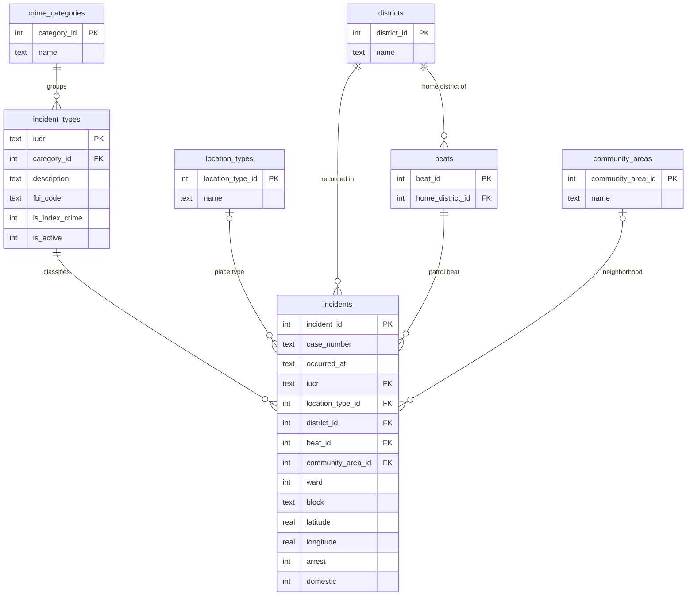
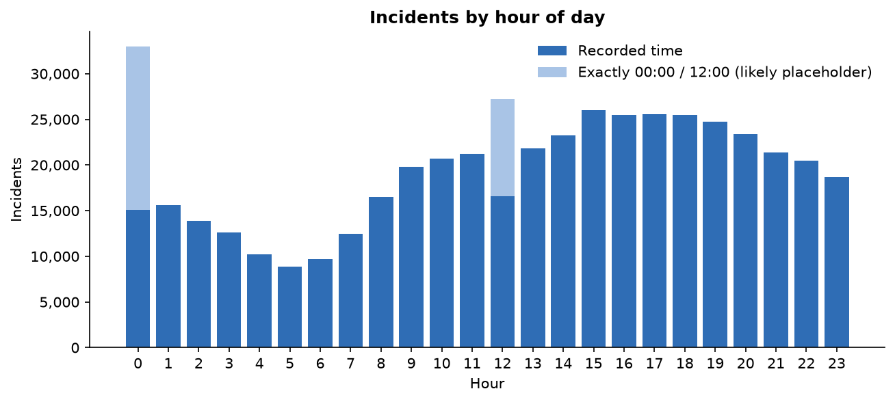
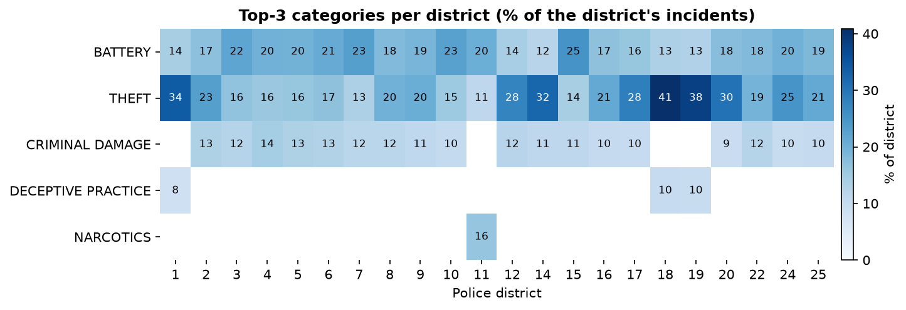
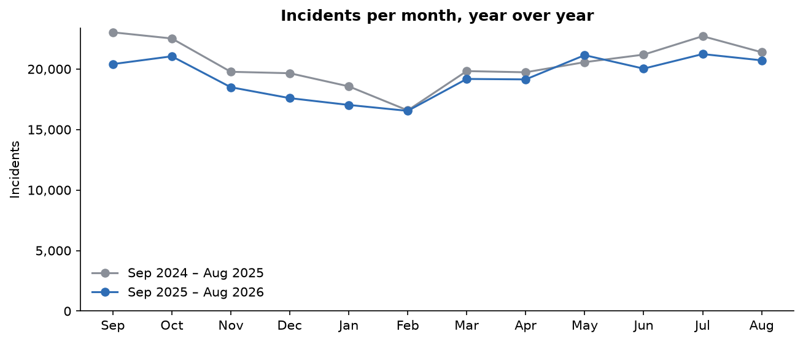
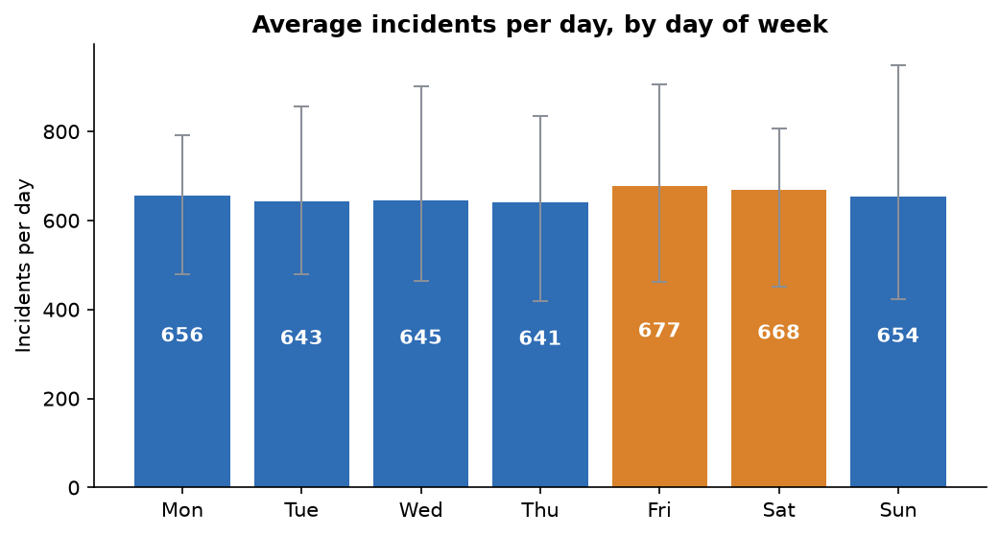
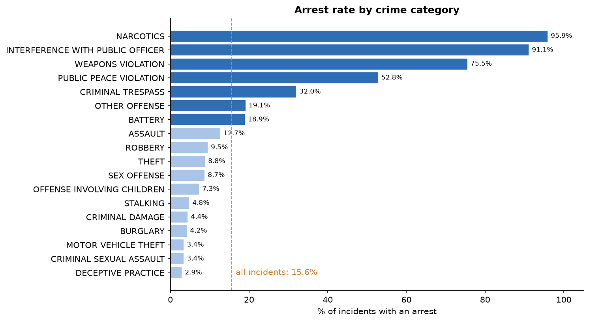
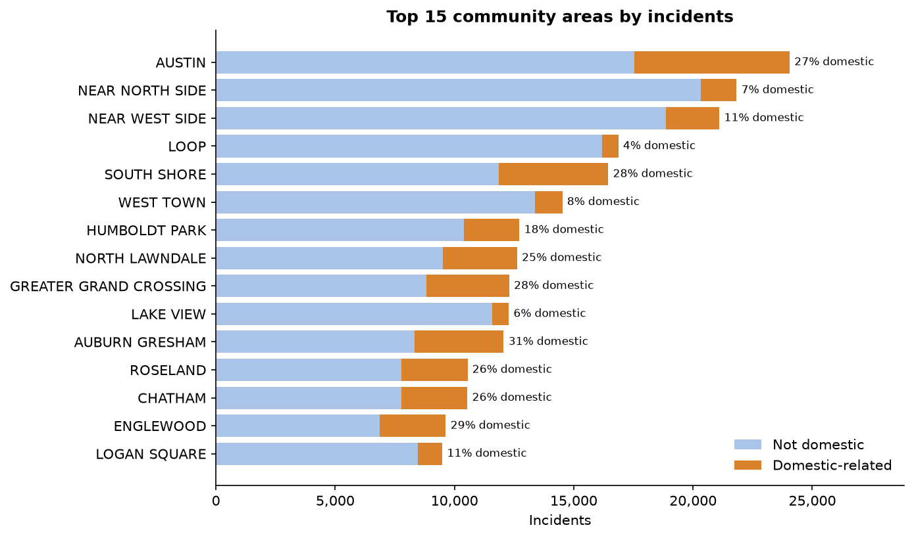

# Crime Data Explorer

A SQL analysis of **478,074 Chicago Police Department incidents** covering two years,
September 2024 through August 2026. The raw data is loaded into a normalized SQLite
database, six analytical queries are run against it, and each result is charted in a
Jupyter notebook.

**Stack:** Python, SQLite, pandas, matplotlib, Jupyter

## Web dashboard

The same six analyses are also available as an interactive dashboard, with filters for
date range, category, district, community area, arrest and domestic flags. It has a
FastAPI backend over `crime.db` and a Chart.js frontend. The backend reuses
[`sql/queries.sql`](sql/queries.sql) directly, adding filters to each query. See
[`app/README.md`](app/README.md).

## Data

Everything comes from the [City of Chicago Data Portal](https://data.cityofchicago.org):

| Dataset | Used for | Rows |
|---|---|---|
| [Crimes – 2001 to Present](https://data.cityofchicago.org/d/ijzp-q8t2) | incidents from 2024-09-01 to 2026-08-31 | 478,074 |
| [IUCR Codes](https://data.cityofchicago.org/d/c7ck-438e) | crime codes, categories, index-crime flag | 434 |
| [Community Areas](https://data.cityofchicago.org/d/igwz-8jzy) | names of the 77 community areas | 77 |
| [Police Districts](https://data.cityofchicago.org/d/24zt-jpfn) | district names | 25 |

The city publishes addresses at block level only, e.g. `076XX S ESSEX AVE`.
The data was downloaded on 2026-09-28. Recent records can still be revised after that date.

## Running it

```bash
python3 -m venv .venv && source .venv/bin/activate
pip install -r requirements.txt

python scripts/fetch_data.py    # downloads ~87 MB of CSVs into data/raw/
python scripts/load_data.py     # builds crime.db in about 5 seconds
jupyter notebook notebooks/explorer.ipynb
```

The raw CSVs and `crime.db` are gitignored. Anyone can rebuild them with the two scripts.
`fetch_data.py` takes `--start` and `--end` if you want a different date range.

## Schema design

The source is a single flat CSV. It is split into a fact table (`incidents`) and
reference tables: one set for *what* happened, one for *where* it happened.



**Read in words:**
- Each **incident** has one **incident type**, identified by its IUCR code.
- Each incident type belongs to one **crime category**, such as THEFT.
- Each incident was recorded in one **district** and one **beat**.
- It may also have a **community area** and a **location type**; either can be unknown.
- Each beat has a **home district**.

Full DDL: [`sql/schema.sql`](sql/schema.sql).

Every decision below was checked against the data before the schema was written:

- **The IUCR code is the key for incident types.** Across all 478k rows, each IUCR code
  always has the same category, description and FBI code. Storing those once in
  `incident_types` removes three repeated text columns from every incident.
- **District is stored on each incident, not derived from beat.** A beat number normally
  encodes its district (beat `0421` is in district 4). But 35 incidents are recorded in a
  different district from their beat's home district, so deriving district from beat would
  silently change those records. `beats.home_district_id` keeps the normal mapping, and
  `incidents.district_id` keeps what was actually recorded.
- **The source `id` is the primary key, not `case_number`.** 50 case numbers appear more
  than once: multi-victim homicides are recorded as one row per victim.
- **Some columns stay on the incident instead of getting their own table.**
  - `ward` is just a number with no other attributes, so a table would add nothing.
  - `block` has 32,000 distinct values and doesn't map cleanly to one community area.
- **Placeholder values become NULL.** Community area `0` and blank location types mean
  "unknown", so the loader stores them as NULL instead of inventing lookup rows.
  District 61 appears in the data but not in the city's district file, so it is loaded
  with no name.
- **Indexes** are on `occurred_at`, `district_id`, `iucr` and `community_area_id`, the
  columns the queries filter and group by. `EXPLAIN QUERY PLAN` confirms SQLite uses them
  as covering indexes.

`load_data.py` checks every foreign key and compares the loaded row count with the CSV.
A 5,000-row sample, rebuilt from the joined tables, matches the original CSV exactly.

## Questions and findings

All queries are in [`sql/queries.sql`](sql/queries.sql). The notebook
[`notebooks/explorer.ipynb`](notebooks/explorer.ipynb) runs each one and shows the SQL,
the result table and a chart.

### 1. When during the day are incidents recorded?



Incidents are **lowest at 5 a.m.** (8,842) and **peak at 3 p.m.** (26,044), about 2.9 times
higher. Counts stay near that peak until 7 p.m. and then taper off overnight.

Taken at face value, the raw counts show midnight as the busiest hour. That's a data
artifact: 6% of all incidents are timestamped exactly 00:00:00 or 12:00:00, far more than
any other single minute. These are most likely placeholders for an unknown time, so the
chart shades them separately.

### 2. What are the most common crime categories in each police district?



**Theft or battery is the most common category in every district.**

- **Theft leads in 14 of 22 districts**, and is most concentrated downtown and on the
  North Side: 41% of incidents in district 18, 38% in district 19 and 34% in district 1.
  Those three are also the only districts where deceptive practice (fraud) makes the top three.
- **Battery leads in the other 8**, all South and West Side districts: 3, 4, 5, 6, 7, 10,
  11 and 15.
- **District 11 is the only district where narcotics makes the top three** (16% of its
  incidents).

### 3. How do incident counts change month to month?



There is a clear seasonal cycle: counts **bottom out in February** (about 16,500) and are
**highest from July to October** (21,000–23,000). Year over year, incidents fell
**5.3%**, from 245,524 to 232,550. **11 of the 12 months** were lower in the second year;
May 2026 was the only exception, up 2.8%.

### 4. Which days of the week have the most incidents?



Averaged per calendar day, **Friday (677) and Saturday (668)** are the busiest days and
**Thursday (641)** is the quietest. But the spread is only 5.6%. The difference between
two days of the same weekday (a Sunday ranged from 423 to 948 incidents) is much larger than
the difference between weekdays.

### 5. How often does an incident lead to an arrest?



Overall, **15.6%** of incidents have an arrest recorded. The rate depends heavily on the
category:

- **Very high: narcotics (96%), interference with a public officer (91%) and weapons
  violations (76%).** These offenses are usually discovered by the police themselves, so
  the report and the arrest tend to happen at the same time.
- **Very low: property crime and fraud**, such as motor vehicle theft (3.4%), burglary
  (4.2%), theft (8.8%) and deceptive practice (2.9%).
- **Criminal sexual assault: 3.4%.**

### 6. Which community areas have the most incidents, and how many are domestic?



**Austin** has the most incidents (24,049). Among the 15 busiest areas there are two
distinct patterns:

- **Downtown and North Side areas** (Loop, Near North Side, Lake View, West Town) have many
  incidents but a low domestic share: 4–8%.
- **South and West Side areas** (Auburn Gresham, Englewood, Greater Grand Crossing,
  South Shore, Austin) have domestic shares of 27–31%.

Citywide, 19% of incidents are flagged as domestic.

### Caveats

- **Counts are not adjusted for population or area.** Downtown's high numbers may partly
  reflect the large number of commuters and visitors there, not just residents.
- **This is reported incident data.** It reflects what was reported to and recorded by
  the police, not all crime that occurred.
- **Recent records can still change.** The arrest flag and crime classification can be
  updated after the download date.

## Project layout

```
crime-data-explorer/
├── scripts/
│   ├── fetch_data.py       # download incidents + lookup tables (stdlib only)
│   └── load_data.py        # build crime.db from the CSVs, with integrity checks
├── sql/
│   ├── schema.sql          # normalized schema + indexes
│   └── queries.sql         # the six analytical queries
├── notebooks/
│   └── explorer.ipynb      # runs the queries, tables + charts
├── output/                 # chart PNGs saved by the notebook
├── data/raw/               # downloaded CSVs (gitignored)
└── requirements.txt
```
